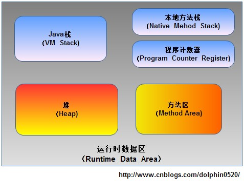

## 概述
jvm在执行Java程序的过程中会把它管理的内存划分成几个不同的数据区域，这些数据区域有着各自的用途和生命周期。如图：

## 程序计数器（Program Counter Register）
- PCR 是一块非常小的内存空间，它是当前线程执行字节码的行号指示器，字节码解释器就是通过PCR来选取下一条需要执行的字节码指令，eg:分支、循环、跳转、异常处理、线程恢复、上下文切换等基础功能。
- JVM的多线程是通过线程轮流切换并分配处理器执行时间的方式来实现的，所以在任何时间节点，一个处理器（内核）都只会执行一个线程中的指令。因此，为了切换线程之后能恢复到正确的执行位置，每个线程都需要一个独立的PCR，各线程之间互不影响，独立存储。
- PCR 是线程私有内存
- PCR 的生命周期与线程相同

## JVM 栈（Stack）
- 和PCR一样，栈也是线程私有内存，其生命周期也是和线程相同。
- 每个Java方法执行的时候都会创建一个栈帧（Stack Frame）,用于存储局部变量表、操作数栈、动态链接、方法出口等信息。
- 没一个方法从调用到执行完成的过程，就对应着一个栈帧从JVM栈中入栈到出栈的过程。

